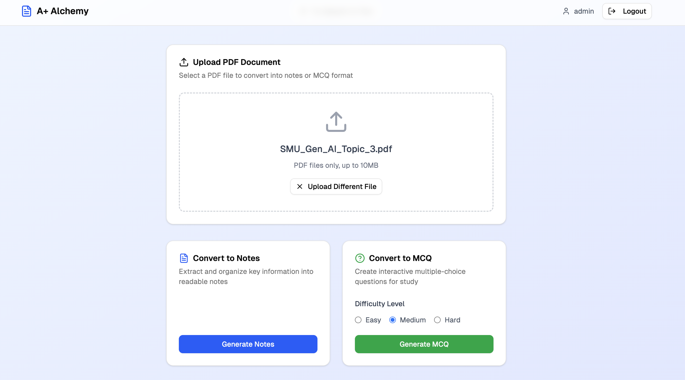
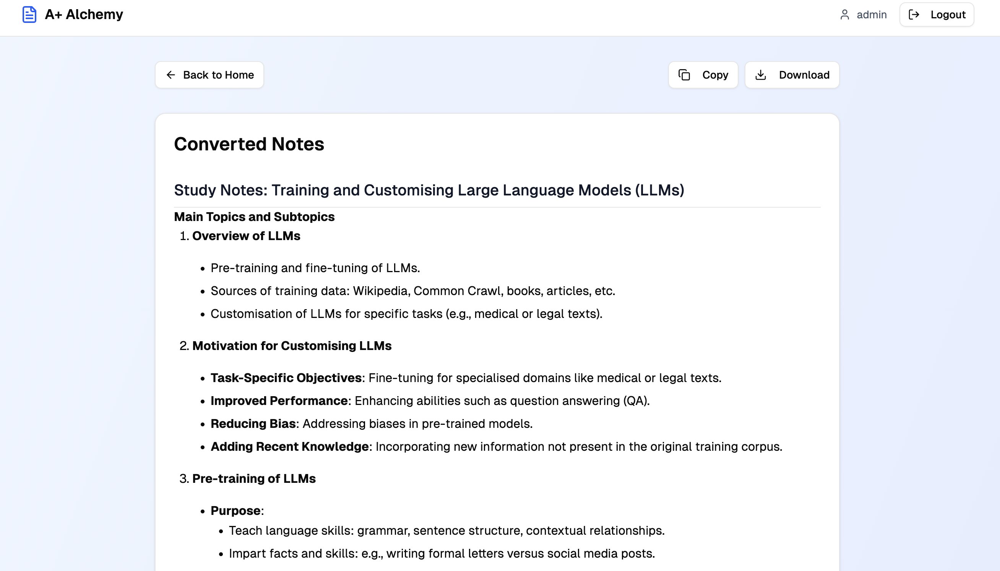
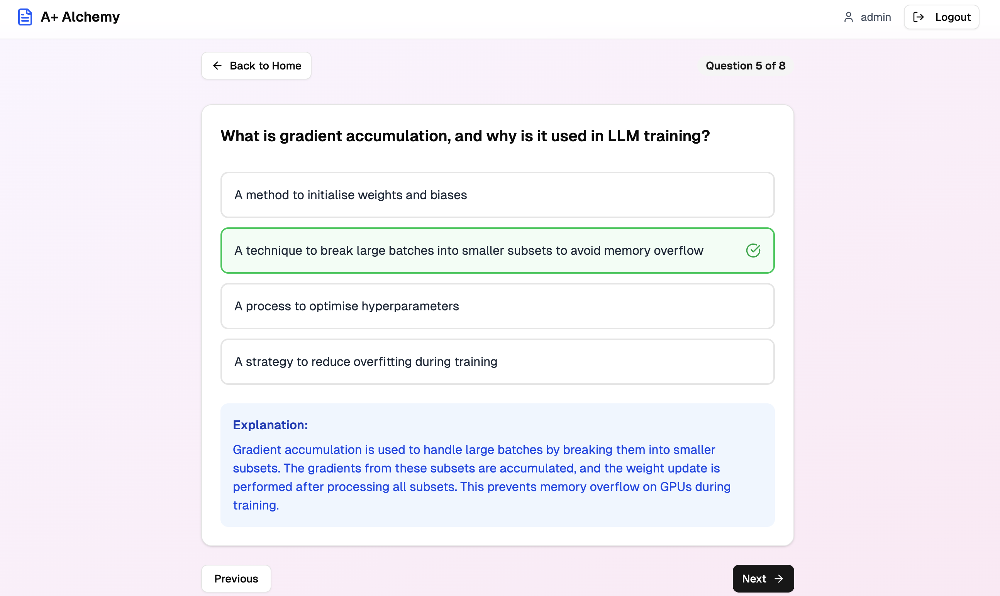

# pinecone-playground

> *Initially wanted to just play around with Pinecone but here I am with a full stack application :p*

**Tired of hitting limits? Frustrated with poorly formatted MCQs?** Say goodbye to messy notes and hello to well-structured generated notes and MCQs—all in one place!

## Features

- 📄 **PDF Upload** - Upload and process PDF documents
- 📝 **Smart Notes Generation** - AI-powered structured study notes
- 🧠 **MCQ Generation** - Multiple-choice questions with difficulty levels (Easy/Medium/Hard)
- 🔐 **User Authentication** - Secure JWT-based login system
- 🎨 **Modern UI** - Clean, responsive Next.js frontend
- 🚀 **Fast API** - High-performance FastAPI backend

## Screenshots

### 🏠 Main Page

### 📖 Notes Generation

### ❓ MCQ Practice
